<center>

  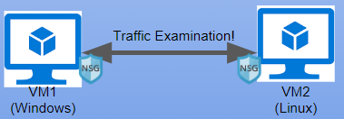
</center>
  


# **Network Security Groups (NSGs) and Inspecting Traffic Between Azure Virtual Machines**

In this project, I have gained hands on experience with network traffic between Azure Virtual Machines using Wireshark, focusing on different protocols such as ICMP, SSH, DHCP, DNS, and RDP. We also experiment with Network Security Groups (NSGs) to control inbound and outbound traffic. This allows me to gain insight into how network traffic flows between virtual machines and how security rules can be used to restrict or permit specific types of traffic.
<br/>

<h2>Environments and Technologies Used</h2>

- Microsoft Azure VM
- Remote Desktop
- Various Command-Line Tools
- Various Network Protocols (SSH, RDP, DNS, HTTP/S, ICMP)
- Wireshark (Protocol Analyzer)

<h2>Operating Systems Used </h2>

- Windows 10 Pro (21H2)
- Ubuntu Server 22.04

<h2>High-Level Steps</h2>

- Create a Resource Group
- Create a Virtual Machine
- Observe ICMP Traffic
- Observe SSH Traffic
- Observe DHCP Traffic
- Observe DNS Traffic
- Observe RDP Traffic

<h2>Create our Virtual Machines</h2>

<h3 align="center">
Set up your virtual environment
</h3>

<p>First, let's create our Resource Group inside our Azure subscription.</p>

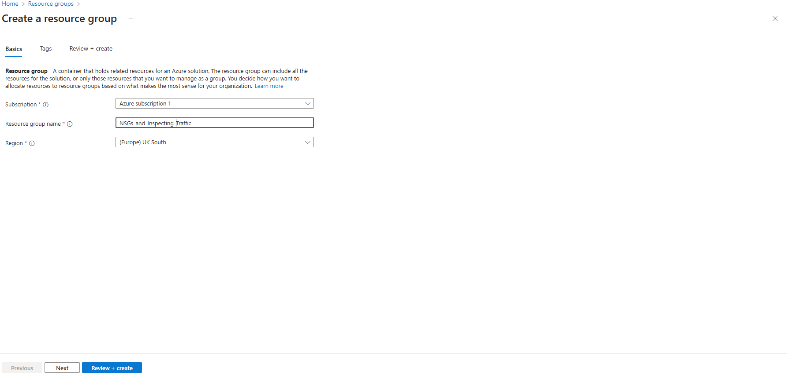

<p>Now create your Windows 10 virtual machine VM.</p>
    - While creating the VM, select the previously created Resource Group
    - While creating the VM, allow it to create a new Virtual Network (Vnet) and Subnet
    - Make sure to use the password option under the Administrator Account section (not seen in image)

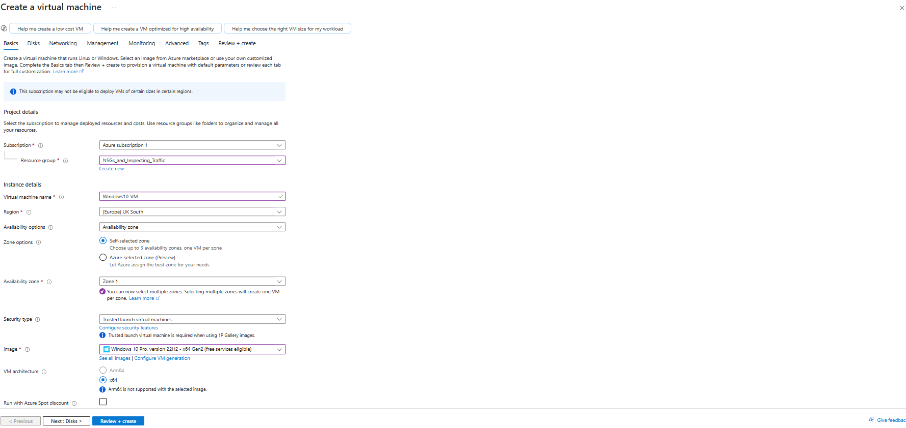

<p>Now create your Linux (Ubuntu) virtual machine VM.</p>
    - While creating the VM, select the previously created Resource Group and Virtual Network—the Virtual Network MUST BE THE SAME.
    - Make sure to use the password option under the Administrator Account section (not seen in image)

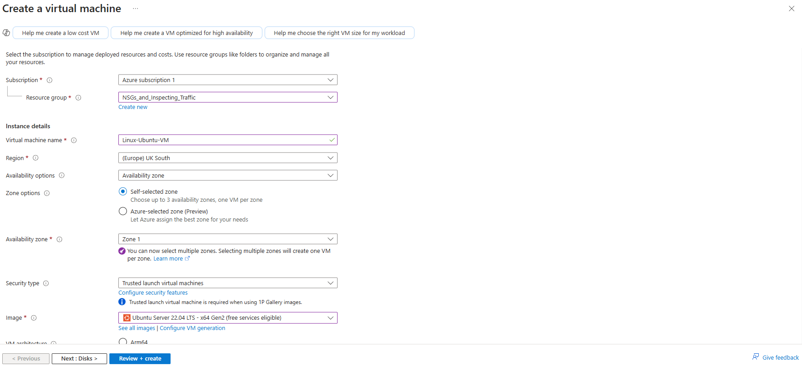

<h3 align="center">
Now let's observe some ICMP traffic
</h3>

<p> Use Remote Desktop to connect to your Windows 10 Virtual Machine </p>

- Within your Windows10-Pro Virtual Machine
  - Install Wireshark: `https://www.wireshark.org/download.html`

<center>
  
  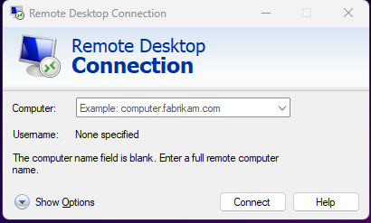
</center>

<p> Retrieve the private IP address of the Ubuntu VM (linux-vm) and attempt to ping it from within the Windows 10 VM
</p>

<p>

Once installed open Wireshark and `filter for ICMP Traffic only`. ICMP is a network layer protocol that relays messages concerning network connection issues. Ping uses this protocol, ping tests connectivity between hosts. 
When we filter wirehsark to only capture ICMP packets and ping the private IP address of our linux machine we can visually see the packets on wireshark.
</p>

```bash
  ping 10.0.0.5
```

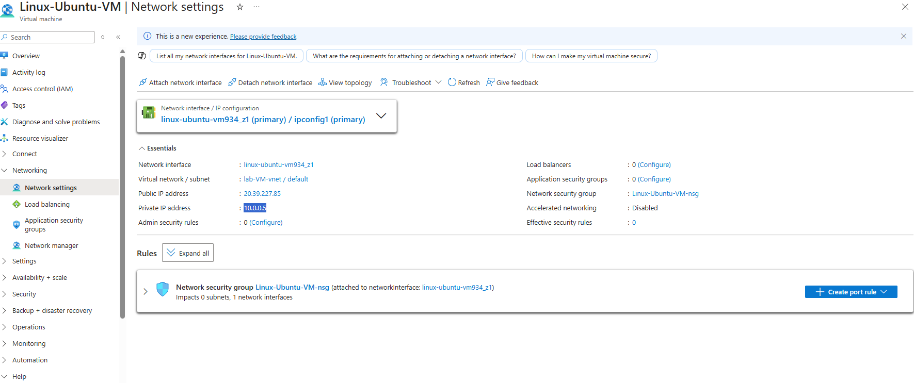

<p align="center"> Observe ping requests and replies within WireShark</p>

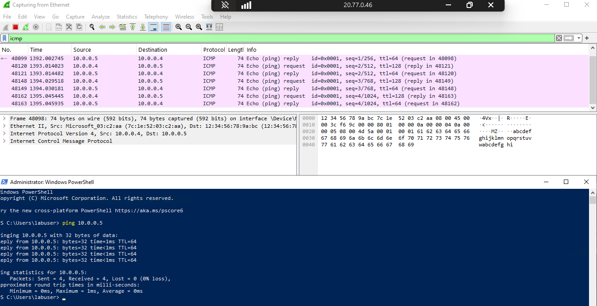

<p>Initiate a perpetual/non-stop ping from your Windows 10 VM to your Ubuntu VM</p>

```bash
  ping 10.0.0.5 -t
```
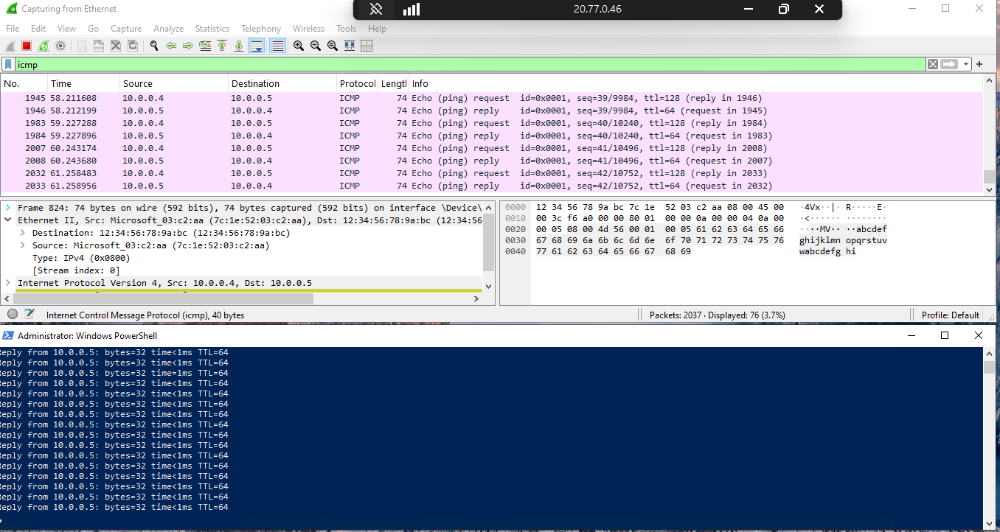

<p>Attempt to ping a public website (such as www.google.com) and observe the traffic in WireShark</p>

```bash
  ping www.google.com
```
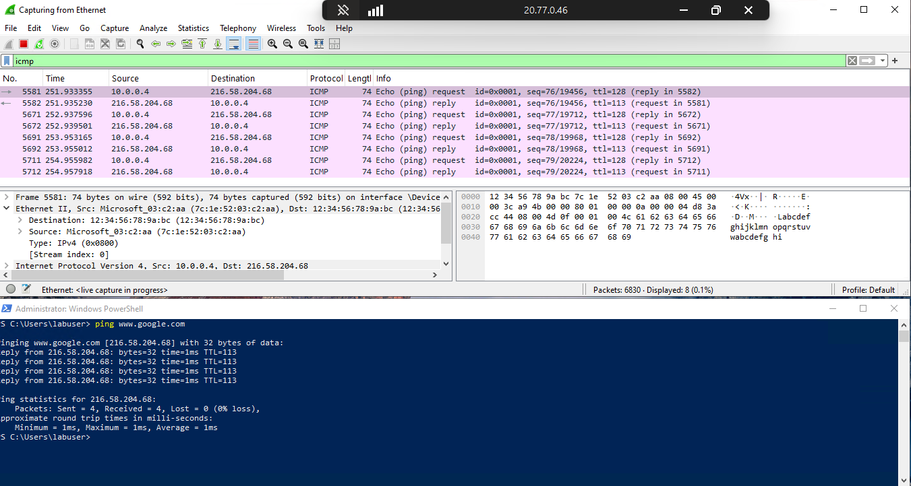


<h3 align="center">
Disable/Re-enable a Firewall [Network Security Group]
</h3>

<p>

In the next portion of the lab we will perpetually ping the Linux machine with the command `ping -t.` This will continually ping the machine until we decide to stop it, while the Windows machine is pinging the Linux machine we will go to the Linux machine and block inbound ICMP traffic on it's firewall. Once we do that we will stop receiving echo reply's from the Linux machine. We will block ICMP by creating a new Network Security Group on the Linux machine that will be set to block ICMP. We can allow the traffic by allowing ICMP on the Linux Network Security Groups page on Azure.
</p>

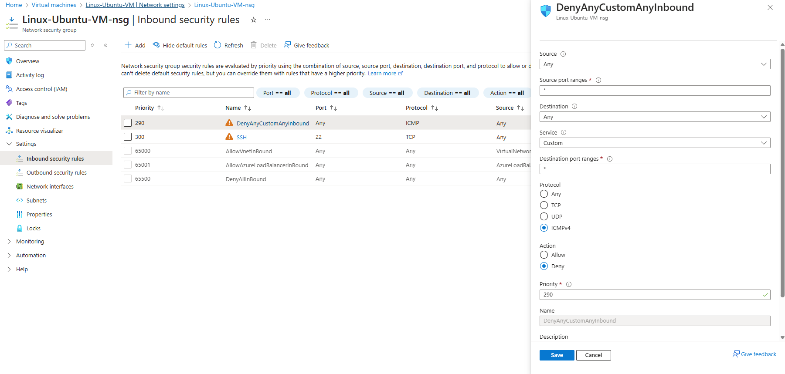
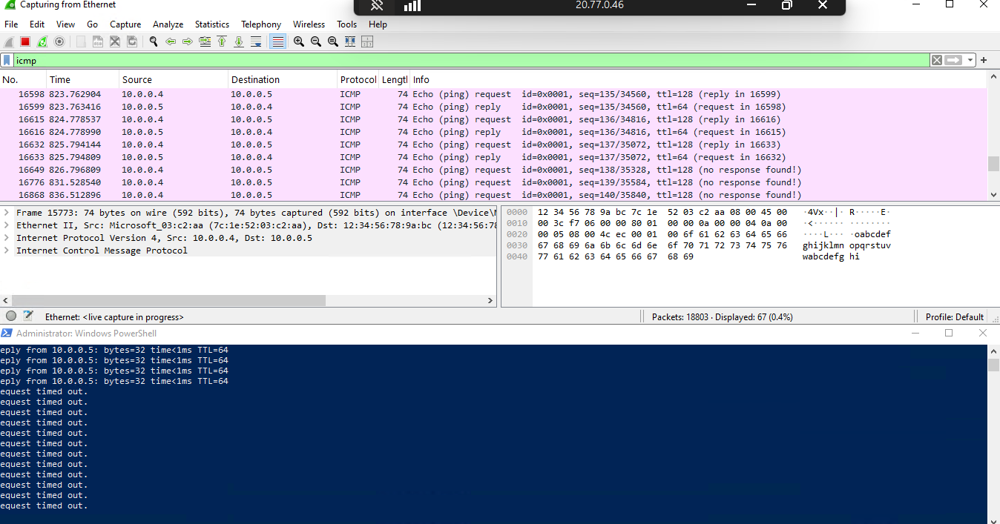

<p align="center">Re-enable ICMP traffic for the Network Security Group your Ubuntu VM is</p>

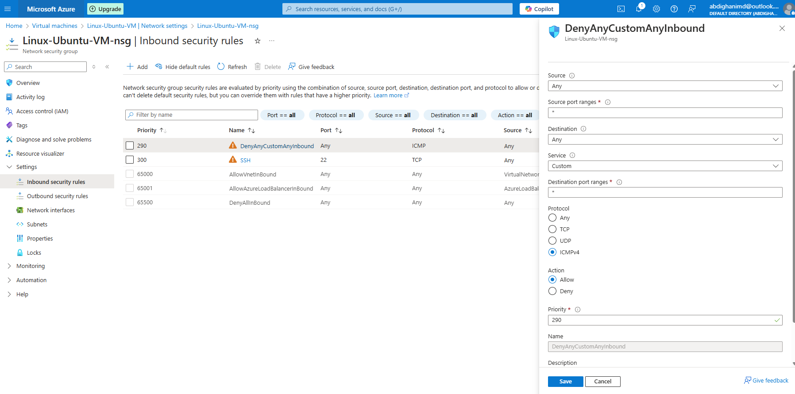

<h3 align="center">
Observe SSH Traffic
</h3>
<p>
Next we will use our Windows machine to SSH to the Linux machine. SSH has no GUI it just gives the user access to the machines CLI. We will set the wireshark filter to capture SSH packets only. When we SSH into the Linux machine with the command prompt "ssh YourComputerName@[private IP address]" we can see that wireshark starts to immediately capture SSH packets.
</p>

command prompt: 
```bash
  ssh labuser@10.0.0.5
```
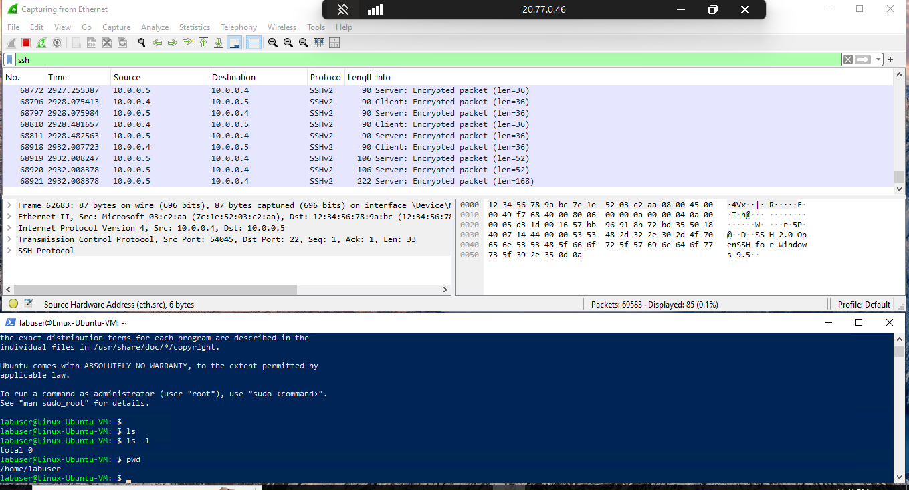


<h3 align="center">
Next, we're going to observe DHCP Traffic
</h3>

<p>
Now we will use wireshark to filter for DHCP. DHCP is the Dynamic Host Configuration Protocol this works on ports 67/68. It is used to assign IP addresses to machines. Run a batch scripts file containing lines with commands such as ipconfig /release and /renew, which are executed sequentially. In order to release the old IP address and request a new IP address. Once we enter the command wireshark will capture DHCP traffic.
</p>

command prompt: 
```bash
  ipconfig /release
```
```bash
  ipconfig /renew
```

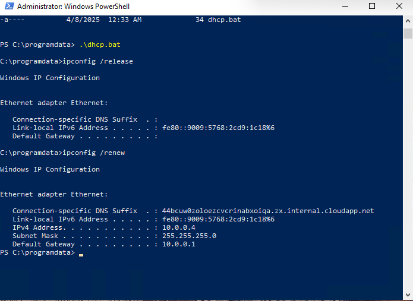
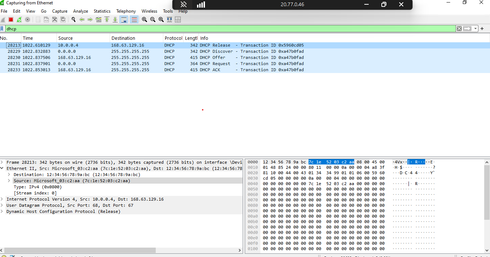


<h3 align="center">
Let's now observe our DNS traffic next
</h3>

<p>
Time to filter DNS traffic. We will set wireshark to filter DNS traffic. We will initiate DNS traffic by typing in the command "nslookup finance.yahoo.com" this command essentially asks our DNS server what is finance.yahoo IP address. 
Note: ALIAS records allow you to point your root domain to another domain name
</p>

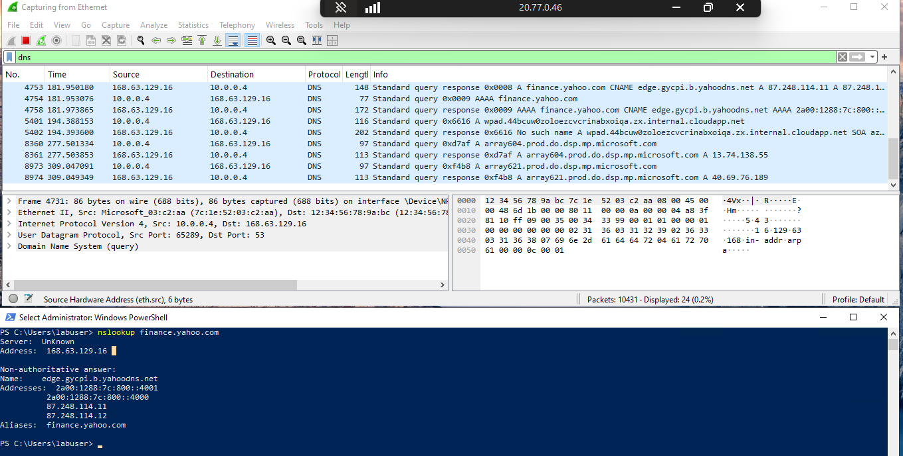

<h3 align="center">
Observe RDP Traffic
</h3>

<p>
Lastly we will filter for RDP traffic. When we enter tcp.port==3389 traffic is spammed non stop because we are using Remote Desktop Protocol to connect to our Virtual Machine. Which maintains a constant stream of updates.
</p>

command prompt: 
```bash
  tcp.port==3389
```

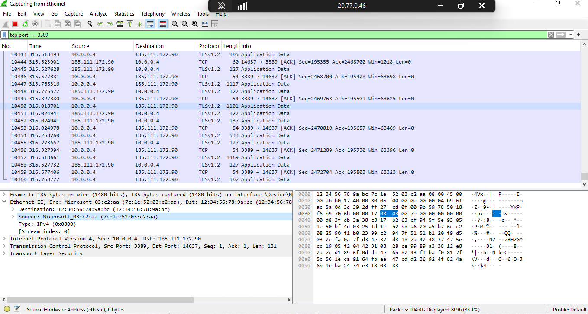


## Author

- [@AbdighaniMD](https://github.com/AbdighaniMD)
